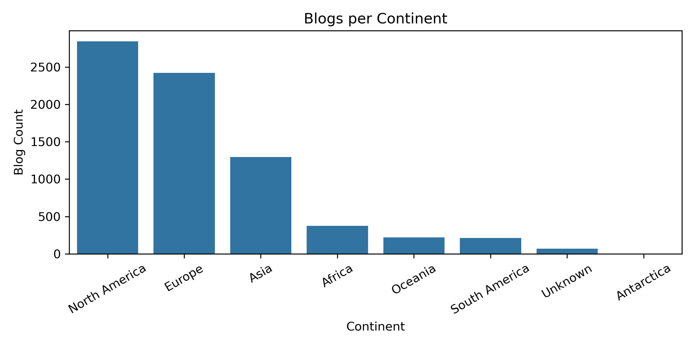
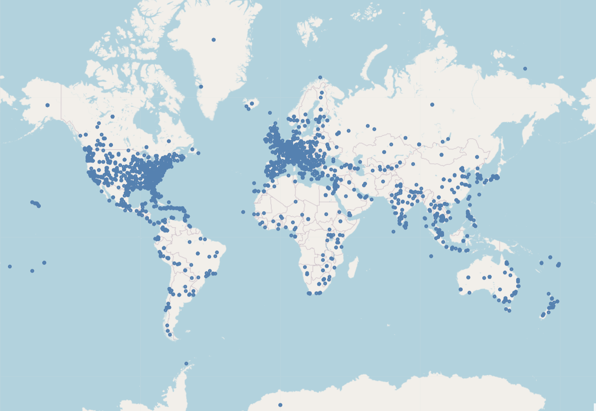
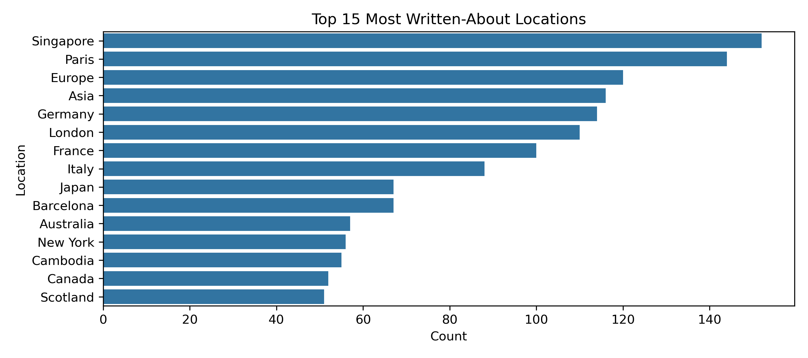
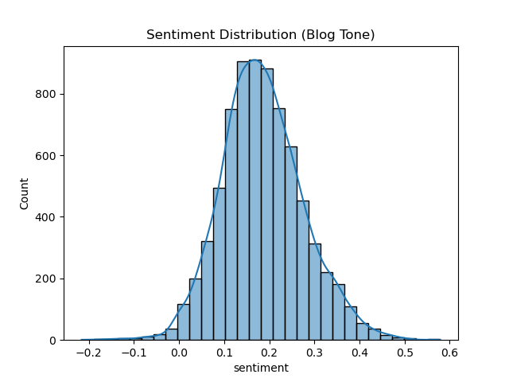

# Off-The-Beaten-Path Travel Recommender — Final Project Discussion

This project set out to reimagine how people discover travel destinations. Instead of repeatedly surfacing the same viral hotspots that dominate TripAdvisor, Google, and social media, our goal was to build a **context-aware recommender** capable of uncovering *hidden gems* places that feel local, underexplored, and aligned with a traveler’s personal style.

To do this, we combined **traditional IR**, **semantic vector retrieval**, **structured attributes**, **popularity dampening**, **LLM-generated explanations**, and a **fully containerized architecture** backed by AWS. The result is a hybrid system that not only retrieves relevant destinations, but also helps users understand *why* they were recommended, all through a clean, modern interface.

---

## 1 Exploratory Data Analysis

Upon conducting exploratory data analysis on our dataset, we summarize key insights from the travel-blog dataset (7,441 blog pages), focusing on geographic patterns, topical concentration, sentiment patterns, and writing behavior. The dataset includes blog metadata (title, URL, description, author) as well as core analytical fields such as location names, latitude/longitude, and full page content, enabling both geographic and textual exploration.

### Dataset Structure and Metadata Overview

Key metadata patterns include:

- **Unique Locations:** 2,061 place names extracted.
- **Blog Diversity:** 60 unique blog domains contribute to the dataset, though a handful of high-volume blogs account for a large share of posts.
- **Author Field:** Nearly all pages share a single aggregated “author” value due to limitations in WordPress metadata extraction.
- **Coordinates:** Lat/lon values are available for all entries, enabling precise geospatial mapping.
- **Content Field:** Nearly all posts include full, untruncated content suitable for NLP tasks (topic modeling, keyword extraction, summarization).

**Selected Summary Statistics**

| Metric                 | Value                               |
| ---------------------- | ----------------------------------- |
| Total Blogs            | 7,441                               |
| Unique Locations       | 2,061                               |
| Top Location           | Singapore (152 mentions)            |
| Most Frequent Blog URL | bobbymgsk.wordpress.com (463 posts) |


### Geographic Distribution of Blogs

**Continent-Level Representation**

{width=70%}

The dataset spans all major world regions, but blog activity is far from evenly distributed.
The bar chart below shows that:

- North America and Europe dominate travel writing volume, together accounting for over half of all entries.
- Asia follows as a strong third region.
- Africa, Oceania, and South America appear less frequently.
- A small number of posts have unknown or unmapped coordinates.

This skew indicates a strong bias toward Western and well-developed tourism ecosystems.

**Global Coverage Map**

{width=70%}

Plotting all blog coordinates on a world map reveals clusterings of posts around:

- The U.S. East Coast, western Europe (especially the UK, France, Germany),
- Japan, Southeast Asia, and Australia,
- With lighter but noticeable contributions across Latin America and Africa.

The map highlights how strongly travel blogging centers around easily accessible, popular, and tourism-heavy destinations.

### Most Written-About Locations

{width=70%}

Across 2,061 unique locations, a small subset receives disproportionate attention.

The top 15 most frequently mentioned places include:

- Singapore (largest count)
- Paris, Europe, Asia, Germany, London
- Highly touristed countries: France, Italy, Japan
- Major cities like Barcelona, New York, Sydney
- Strong regional identifiers such as Scotland, Canada

These counts reveal two patterns:

1. Global cities and cultural capitals dominate, reflecting common bucket-list travel behavior.
2. Broad geographic labels (e.g., Europe, Asia) are used frequently, suggesting many posts focus on multi-country itineraries.

### Blog Tone and Sentiment

{width=70%}

Sentiment analysis on the blog content shows a strongly positive skew. Most sentiment scores cluster around 0.15–0.25, reflecting overall upbeat, inspirational, and reflective travel writing. Only a small percentage of posts express negativity—typically related to travel mishaps, warnings, or comparisons of expectations vs. reality. The bell-shaped distribution indicates that despite stylistic differences across authors, travel blogs generally maintain a consistently positive narrative tone.

---

## 2. Retrieval Models: Lexical, Semantic, and Hybrid Reasoning

The system supports two complementary retrieval engines:

### **BM25 Keyword Retrieval**
Our first baseline was a BM25 search engine over a corpus of travel blogs. It works well for:
- Precise keyword queries  
- Debugging and metadata validation  
- Transparent, interpretable ranking  

However, BM25 also revealed a core challenge:  
**frequently mentioned destinations automatically rise to the top**, reinforcing popularity bias.

### **ModernBERT Semantic Search**
To move beyond surface-level text matching, we introduced **ModernBERT-based dense vector retrieval**. Travel blog content is encoded offline into high-dimensional embeddings and indexed with FAISS, enabling fast semantic similarity search.

Semantic retrieval excels at:
- Experience-oriented prompts (*“quiet coastal villages”*)  
- Synonym-rich queries (*“trek” vs. “hike”*)  
- Meaning-first exploration when users don’t know exact keywords  

The backend dynamically routes user queries to BM25 **or** ModernBERT based on UI selection.

### **Attribute + Context Ranking**
To counteract popularity bias, we built a scoring layer that integrates:
- **Attribute matching** (geographic type, cultural tags, experience tags)  
- **Context cues** such as “hidden gem,” “locals only,” “underrated”  
- **Query overlap**  

This reranking layer highlights blog posts that explicitly describe destinations as quiet, local, off-the-path, or crowd-free.

---

## 3. ModernBERT Embeddings & FAISS Vector Search

A key enhancement was a dedicated semantic search pipeline (`backend/bert`):

1. **Preprocess blog text**  
2. **Generate ModernBERT embeddings** (`nomic-ai/modernbert-embed-base`)  
3. **Store embeddings** in `.pt` format  
4. **Load vectors** into a FAISS L2 index at runtime  
5. **Embed queries** on the fly  
6. **Retrieve nearest-neighbor blog chunks** by semantic similarity  

This dramatically improved the recommender’s ability to interpret flexible, natural language queries.

---

## 4. Offline Processing Pipeline

Before deployment, a full offline workflow transforms raw data into structured, searchable form.

| Stage | Purpose |
|-------|---------|
| **Scraping** | Collect travel blog pages using BeautifulSoup + SerpAPI |
| **Cleaning** | Strip HTML noise, normalize text, drop irrelevant content |
| **Feature Engineering** | Named entity recognition, metadata extraction, text chunking |
| **Embedding Generation** | Convert text into ModernBERT dense vector embeddings |

Outputs include:
- Clean metadata stored in **Postgres**
- Embeddings stored in **S3 / object storage**
- Local mirrors under `data/raw` and `data/processed`

This separation between **offline preprocessing** and **online inference** ensures fast and scalable search during runtime.

---

## 5. Storage & Cloud Architecture

The system uses a dual-storage design:

### **Postgres**
Stores:
- Titles  
- Summaries  
- URLs  
- Authors  
- Structured metadata  

Used for context and UI display.

### **S3 Object Storage**
Stores:
- ModernBERT embeddings  
- Processed blog datasets  
- BM25 evaluation outputs  

AWS credentials are loaded from environment variables, enabling containerized services to consistently access cloud data across machines.

---

## 6. End-to-End Runtime Flow

The runtime architecture includes a **Streamlit frontend**, a **FastAPI backend**, and **AWS-hosted data**.

### **Frontend (Streamlit UI)**
- Guided input for structured and descriptive queries  
- Model switcher (BM25 vs. ModernBERT)  
- Card-style destination results  
- pydeck-powered interactive world map  
- Diagnostics tab for transparency  

### **Backend (FastAPI)**
- Receives search requests  
- Runs BM25 or ModernBERT retrieval  
- Optionally applies Attribute+Context reranking  
- Generates LLM explanations  
- Returns structured results with scores, metadata, and coordinates  

### **User Flow Summary**
1. User submits query  
2. Backend selects retrieval engine  
3. Candidates are retrieved  
4. Reranking adjusts for authenticity  
5. LLM explanation is produced  
6. UI displays destinations, map markers, and diagnostics  

---

## 7. LLM Explanations: Interpretable Recommendations

To enhance interpretability, we integrated a **language-model explanation layer**.

Given:
- The user query  
- Relevant blog snippets  
- Destination metadata  

The system generates a short, human-readable justification. Example:

> “This destination fits your interest in quiet coastal experiences, with blog references to secluded beaches and early-morning markets away from crowds.”

These explanations:
- Improve user trust  
- Help diagnose ranking behavior  
- Make results feel curated and personalized  

---

## 8. Frontend Design & UX Improvements

We made several UX decisions to improve usability:

### **Structured Query Prompts**
Instead of one long text box, users provide:
- Desired vibe  
- Activities  
- Geographic preferences  
- Filters and tags  

These are combined into a rich query for better retrieval.

### **Card-Style Result Layout**
Each card includes:
- Score & confidence  
- Destination name  
- Tags  
- Snippet preview  
- Source link  

### **Interactive Map**
A global pydeck map visualizes:
- Coordinates of destinations  
- Relevance score via color  

### **Diagnostics Tab**
Reveals:
- Resolved filters  
- Model parameters  
- Reranking settings  

This adds transparency and makes evaluation easier.

---

## 9. Containerization & Deployment

The entire system is Dockerized.

- `backend/Dockerfile.api` → FastAPI service  
- `frontend/Dockerfile.streamlit` → Streamlit UI  
- `docker-compose.yml` → Multi-service orchestration  

Running:

```bash
docker-compose up --build

```
starts:
- API on 8081
- UI on 8501

This ensured reproducibility and simplified team development across different environments.

---
## 10. Limitations

Despite strong performance, the system has several constraints:

- Corpus Coverage: Recommendations reflect only the regions represented in our blog dataset.
- LLM Latency & Cost: Explanations rely on a hosted LLM with nontrivial inference cost.
- Popularity Approximation: Frequency in blogs is only a proxy for real-world tourism pressure.
- Model Dependency: ModernBERT’s quality depends on the domains it was trained on.

---
## 11. Future Work

Potential extensions include:

- Full learning-to-rank models combining BM25, ModernBERT, and context cues
- Personalized recommendations via user profiles
- Popularity modeling with Google Trends
- On-device caching for faster embedding inference
- MLflow integration and more robust experiment tracking
- Enhanced geographic storytelling in the UI

# Conclusion

This project demonstrates that blending classical IR, semantic embeddings, structured attributes, popularity correction, LLM explanations, and a polished UI all deployed through Docker and supported by AWS can produce a compelling prototype for discovering truly off-the-beaten-path travel destinations.

The system doesn’t just search:
- It interprets.
- It explains.
And most importantly, it helps travelers find places worth discovering.