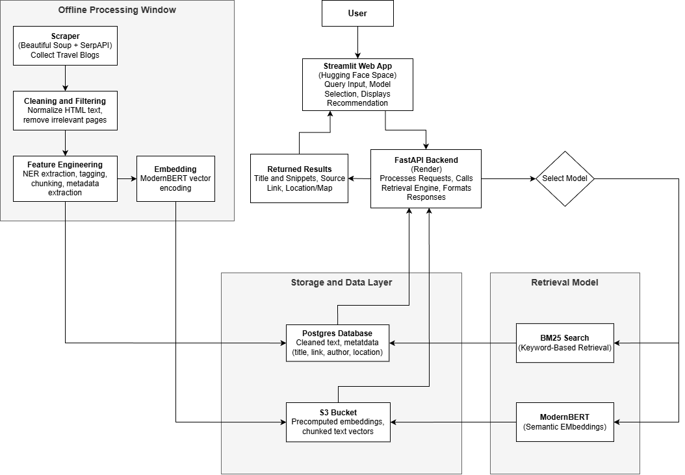

# System Architecture

*Figure: High-level end-to-end architecture of the Off-The-Path Travel Recommender System.*

This document explains how the system is structured, how data moves across components, and how user queries flow from the UI to retrieval models and back. The goal is to allow any new contributor to quickly understand the full pipeline — from raw travel blogs → processed embeddings → real-time search results returned to the user.

---

## 1. Offline Processing Window

This part of the system runs before deployment and prepares the content that powers the search engine.

**Pipeline Stages**

| Stage | Description |
|---|---|
| **Scraper** | BeautifulSoup + SerpAPI collect blog pages containing travel content |
| **Cleaning & Filtering** | Removes HTML noise, normalizes formatting, drops irrelevant content |
| **Feature Engineering** | NER extraction, metadata tagging, chunking into smaller documents |
| **Embedding Generation** | ModernBERT encodes text chunks into dense semantic vectors |

Output of this window is clean structured text + embeddings, which are stored for retrieval.

---

## 2. Storage & Data Layer

Data is stored using a dual-system setup — structured metadata goes to Postgres while embeddings are stored efficiently in object storage.

| Component | Stored Data | Purpose |
|---|---|---|
| **Postgres Database** | Titles, text, source URL, author, metadata | Fast document lookup and metadata retrieval |
| **S3 Bucket** | Pre-computed embeddings, chunk vectors | Used during semantic similarity search |

This design supports scalability, fast nearest-neighbor search, and API responsiveness.

---

## 3. Retrieval Model Layer

Two engines power search depending on user preference:

| Model | Retrieval Style | Strength |
|---|---|---|
| **BM25** | Keyword-based lexical ranking | Good for exact keyword matches |
| **ModernBERT** | Dense vector semantic similarity | Good for meaning-based queries |

The backend can route to BM25 or ModernBERT based on a user’s model selection.

---

## 4. Runtime Application Flow

**Frontend – Streamlit App (HuggingFace Space)**  
- User enters a query & selects retrieval model  
- Displays ranked recommendations with titles, snippets, links, & maps

**Backend – FastAPI (Render Docker container)**  
- Receives requests from UI  
- Runs BM25 or ModernBERT retrieval  
- Formats and returns results to the frontend for display  

---

## End-to-End Flow Summary

1. Data scraped and processed offline  
2. Metadata stored in Postgres; embeddings in S3  
3. User submits query via Streamlit UI  
4. Backend selects BM25 or ModernBERT retrieval  
5. Relevant results returned and displayed  

This architecture separates offline preprocessing from real-time serving, making the system fast, scalable, and easy to iterate on.
