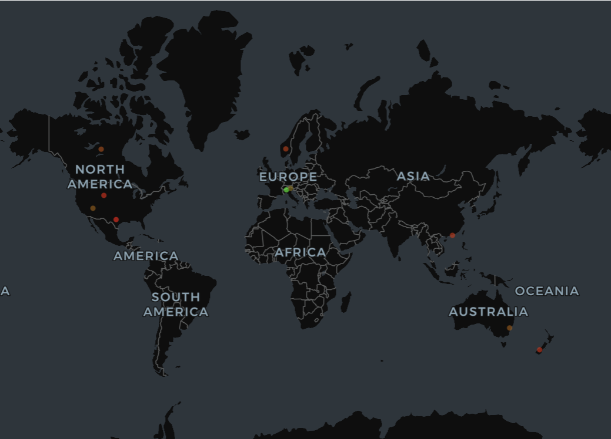
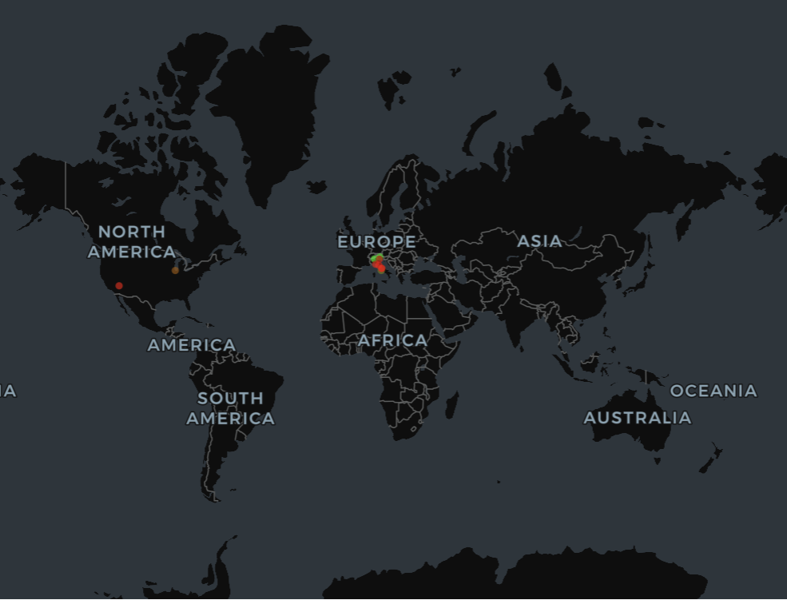
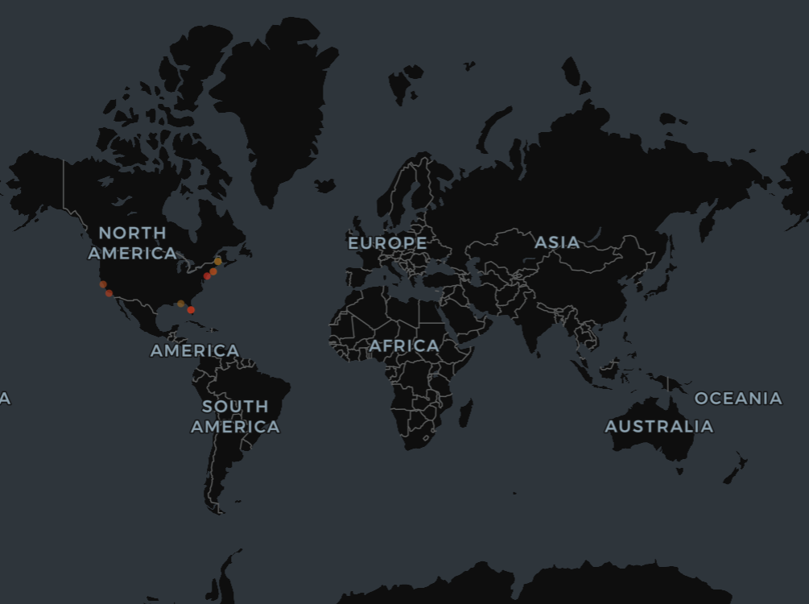
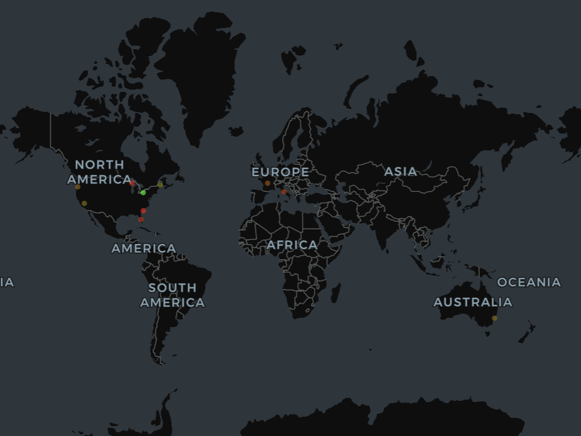

This section presents qualitative results from the deployed Off-the-Beaten-Path Travel Recommender, comparing BM25 and ModernBERT (FAISS) retrieval on real queries against the live system.

---

# Live Example Query

This video demonstrates the capabilities of the Streamlit/Hugginface spaces frontend website, using a user query of "oceanside town known for good waves and surfing".

<video width="100%" height="auto" controls>
  <source src="./img/query_example.mp4" type="video/mp4">
  Your browser does not support the video tag.
</video>

---

# Query 1: "Hiking trails in the Dolomites Italy"

**Selected Activities:** hiking, camping, fishing, climbing
**Geographic Type:** mountains

An explicit, keyword-heavy query (activity + destination + country) chosen to showcase BM25's lexical strengths.

## BM25 Results

| Rank | Destination              | Relevance Score | Notes                                                        |
| ---: | ------------------------ | --------------- | ------------------------------------------------------------ |
|    1 | Alps                     | **46.63**       | Exact keyword overlap with "Dolomites," "Alps," "hiking"      |
|    2 | Pieralongia (Dolomites)  | **38.68**       | Strong match on Dolomites landmarks and hiking terms          |
|    3 | U.S. Virgin Islands      | **37.59**       | High activity overlap, but incorrect geography                |
|    4 | Yosemite National Park   | **37.40**       | Mountain hiking content, but unrelated region                 |
|    5 | Canada                   | **36.50**       | Broad hiking/camping mentions; country-level                  |
|    6 | Norway                   | **35.36**       | Frequent hiking and mountain keywords                         |
|    7 | Hong Kong                | **34.84**       | Hiking-related content despite urban setting                  |
|    8 | Lake Hāwea (New Zealand) | **34.30**       | Outdoor hiking narratives, but distant geography               |
|    9 | Midwest (USA)            | **33.71**       | Seasonal outdoor activity content                              |
|   10 | Texas                    | **32.30**       | Canyon hiking; strong activity terms                           |

**Interpretation:** The top two results (Alps, Pieralongia) are correctly grounded in the Dolomites, showing BM25's strength on explicit queries. Beyond that, relevance degrades quickly—results 3–10 span the Caribbean, North America, Scandinavia, East Asia, and Oceania, retrieved mainly for hiking/camping/mountain keyword density rather than alignment with Italy specifically. This illustrates BM25's key limitation: it scores query terms independently and doesn't enforce joint constraints across activity, terrain, and location.

**LLM explanations** for the top results confirm this: Alps and Pieralongia both cite specific Dolomites trails and landmarks (Seceda, Alpe di Siusi, via ferrata routes), while the U.S. Virgin Islands explanation reveals the activity match without the geographic one—hiking/camping/climbing content, wrong hemisphere.

## ModernBERT (FAISS) Results

| Rank | Destination                 | Semantic Distance | Notes                                                           |
| ---: | --------------------------- | ----------------- | ---------------------------------------------------------------- |
|    1 | Alps                        | **0.49**          | Direct semantic match to hiking in the Dolomites                 |
|    2 | Pieralongia (Dolomites)     | **0.50**          | Highly specific Dolomites landmark with hiking focus              |
|    3 | Rome (Abruzzo / Gran Sasso) | **0.57**          | Mountain hiking in Italy; conceptually similar, wrong region      |
|    4 | Chicago                     | **0.60**          | Outdoor nature narrative, weak mountain relevance                 |
|    5 | Italy                       | **0.62**          | Broad country-level match; lacks specificity                      |
|    6 | Amalfi Coast                | **0.64**          | Italy content; coastal rather than mountainous                    |
|    7 | Cinque Terre                | **0.64**          | Hiking present, but coastal villages dominate                     |
|    8 | Florence                    | **0.65**          | Tuscan hills; weak hiking specificity                              |
|    9 | Cinque Terre                | **0.65**          | Similar to rank 7; scenic hiking, not alpine                      |
|   10 | Italy                       | **0.66**          | Generic Italy travel overview                                     |

*Lower distance = higher semantic similarity.*

**Interpretation:** The top two results match exactly on both geography and activity. As rank increases, results broaden gradually by concept rather than degrading abruptly—Rome/Abruzzo stays relevant via dolomite-peak and national-park language even though it's the wrong region, and lower ranks drift toward general Italy travel content and lighter, non-alpine hiking (Amalfi Coast, Cinque Terre, Florence). This smooth relaxation of specificity contrasts with BM25's sharper, noisier drop-off.

**Key takeaway:** ModernBERT preserves mountain-hiking intent even as geography drifts and avoids the activity-only false positives (e.g., tropical islands) that BM25 produces, making it better suited to queries where intent matters more than exact wording.

---

# Query 2: "Small seaside towns known for local food and slow travel"

**Selected Activities:** museums, swimming, sailing, eating
**Geographic Type:** coastal, seaside, beach

A more experiential, lifestyle-oriented query used to test how each model handles nuance beyond simple keyword matching.

## BM25 Results

| Rank | Destination             | Relevance Score | Notes                                                                  |
| ---: | ----------------------- | --------------- | ------------------------------------------------------------------------ |
|    1 | Maine                   | **49.55**       | Strong lexical match on "coastal," "beach towns," seaside language        |
|    2 | Boston                  | **48.92**       | Matches "towns near Boston," coastal context implied                     |
|    3 | Grayton Beach           | **42.11**       | Explicit seaside town with food and beach activities                     |
|    4 | San Francisco           | **40.61**       | Urban coastal city; weak "small town" alignment                          |
|    5 | Santa Barbara           | **39.89**       | Coastal destination; more city-like than town                            |
|    6 | Florida (Seaside / 30A) | **39.47**       | Strong beach and food overlap; region-level                              |
|    7 | Florida (30A region)    | **39.46**       | Similar to rank 6; repeated coastal keyword hits                          |
|    8 | Maine                   | **39.29**       | Duplicate regional result; broad coastal framing                          |
|    9 | Astoria, Oregon         | **38.12**       | Small coastal town with cultural relevance                                |
|   10 | Boston                  | **37.61**       | Duplicate regional entry                                                  |

**Interpretation:** BM25 reliably surfaces coastal destinations but ranks broad regions and cities (Maine, Boston, San Francisco) above smaller towns despite the "small" constraint, and repeats the same region multiple times due to keyword density rather than destination granularity—showing it emphasizes keyword frequency over interpretive intent like "slow travel."

**LLM explanations** show Maine's result draws on Ogunquit/Kennebunkport/Wells content (seafood, museums, seaside activities), Boston's draws on nearby Rockport rather than the city itself, and Grayton Beach is one of the strongest true town-level matches in the set.

## ModernBERT (FAISS) Results

| Rank | Destination                      | Semantic Distance | Notes                                                         |
| ---: | --------------------------------- | ----------------- | ---------------------------------------------------------------- |
|    1 | South Shore (MA)                 | **0.57**          | Strong match to slow travel, coastal towns, local culture         |
|    2 | Maine                             | **0.61**          | Small seaside towns with food, museums, sailing                   |
|    3 | California                        | **0.62**          | Small towns and hidden beaches; experiential alignment             |
|    4 | Sydney                             | **0.62**          | Coastal lifestyle and day trips; city-level                        |
|    5 | Salem (MA)                        | **0.62**          | Historic coastal town with museums and walkability                 |
|    6 | France (La Rochelle / Île de Ré) | **0.63**          | Seaside towns emphasizing slow travel and food                     |
|    7 | Italy                              | **0.64**          | Cultural and culinary focus; broad geography                       |
|    8 | Florida (Seaside / 30A)          | **0.64**          | Coastal living and relaxed pace                                    |
|    9 | Northern Michigan                 | **0.65**          | Small coastal town with local character                            |
|   10 | Charleston                         | **0.66**          | Historic coastal city; less "small town"                           |

*Lower distance = higher semantic similarity.*

**Interpretation:** The top result, South Shore (MA), reflects the full query intent—quiet towns, museums, sailing, a relaxed pace—and Maine/Northern Michigan follow for similar reasons. Notably, France (La Rochelle / Île de Ré) ranks highly despite being geographically distant, showing the model generalizing "slow seaside living" across countries rather than matching on location keywords. Lower ranks broaden toward city- and country-level entries (Sydney, Charleston, California, Italy) that partially relax the "small town" constraint.

**Key takeaway:** ModernBERT captures experiential and lifestyle intent (slow travel, local culture, town scale) that BM25's keyword matching misses, and relaxes constraints gradually rather than dropping into unrelated results—making it the stronger choice for exploratory, feel-based travel queries.
